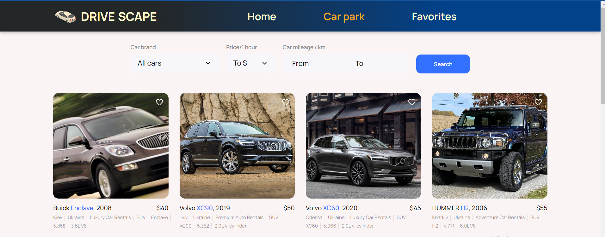
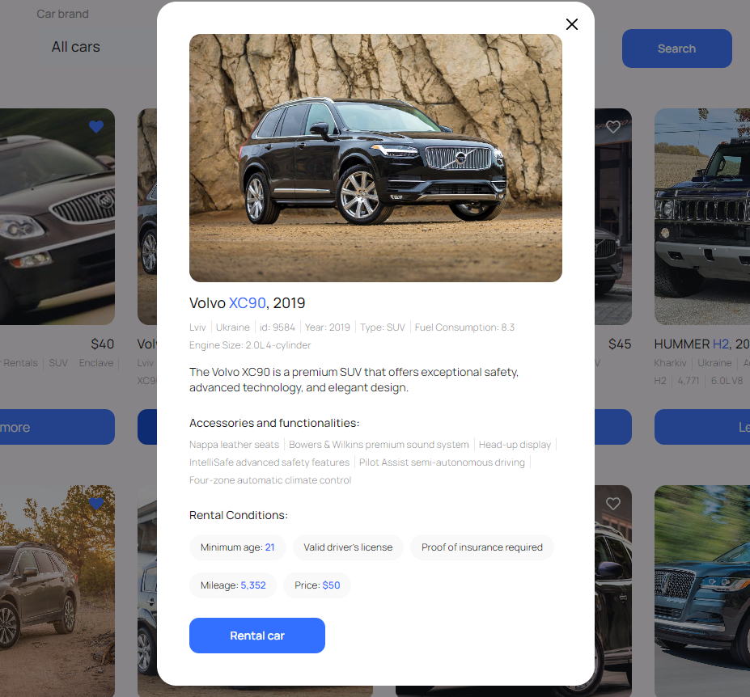
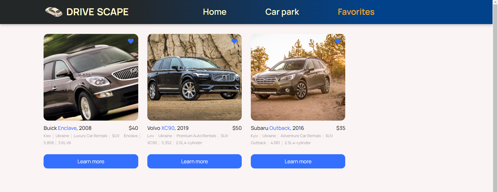

Welcome to the car rental website!

This site is designed to make it easy for people to rent a car. This saves them
time and effort.

This site consists of three pages:

1. Home page (This page describes the company's benefits and services).

2. Catalog page (On this page, you can view all the cars available for rent.
   There is also filtering of cars by brand, price per hour, and mileage. When
   the user clicks on heart, the car is added to the list of favorites, which
   can be viewed on the favorites page. Pagination is also implemented here.
   First, twelve cars are shown. When you click on the load more button, twelve
   more are added).

Also, clicking on the learn more button will open detailed information about the
car. To contact the company, click on the rental car button, then the phone
number will open.

3. Favorites page ( This page stores the cars the user chose as favorites).

The following technologies were used to develop this site:
1) HTML
2) CSS
3) JavaScript
4) React
5) Redux Toolkit
6) Mockapi
